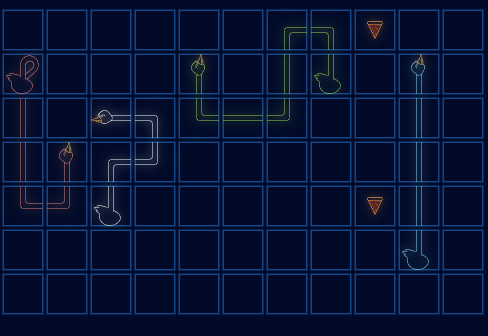

Deep Q-Learning for Hungry Geese
==============================

This is the final project for "Machine Learning: Advanced" course provided by Otus. Here we leverage reinforcement learning to teach the agent (one of given geese) how to play and win the game.

This game was implemented for following competition. https://www.kaggle.com/competitions/hungry-geese. By this link you can find the rules of the game.

Following code is partly based on following guide: https://lightning.ai/docs/pytorch/stable/notebooks/lightning_examples/reinforce-learning-DQN.html and it was significantly modified in order to adopt it for given task.

## Usage

### Set up the enviroment

Make sure that Python 3.10 and Poetry are installed on your system. Run following commands to set up the virtual enviroment

```
poetry install
```

After this, activate the enviroment

```
poetry shell
```

### Fit DQN

Run training by using src/train.py

```
python train.py --model_config_path ../config/model_config.yaml --env_config_path ../config/env_config.yaml 
```

### Evaluate the model images

Evaluate the model by using src/inference.py

```
python inference.py --model_config_path ../config/model_config.yaml --env_config_path ../config/env_config.yaml 
```

Project Organization
------------

    ├── LICENSE
    ├── Makefile           <- Makefile with commands like `make data` or `make train`
    ├── README.md          <- The top-level README for developers using this project.
    │
    ├── docs               <- A default Sphinx project; see sphinx-doc.org for details
    │
    ├── models             <- Trained and serialized models.
    │
    ├── notebooks          <- Jupyter notebooks.
    │
    ├── references         <- Data dictionaries, manuals, and all other explanatory materials.
    │
    ├── reports            <- Generated analysis as HTML, PDF, LaTeX, etc.
    │   └── figures        <- Generated graphics and figures to be used in reporting
    │
    ├── pyproject.toml     <- The requirements file for reproducing the analysis environment
    │
    ├── poetry.lock        <- Automatically generated file with fixed packages' versions
    │
    ├── setup.py           <- makes project pip installable (pip install -e .) so src can be imported
    ├── src                <- Source code for use in this project.
    │   ├── __init__.py    <- Makes src a Python module
    │   │
    │   ├── data           <- Tools for data manipulation
    │   │   ├── data.py
    │   │   │
    │   │   └── features.py
    │   │
    │   ├── models         <- Tools for modeling
    │   │   └── model.py
    │   │
    │   ├── visualization  <- Tools to create exploratory and results oriented visualizations
    │   │   └── visualize.py
    │   │
    │   ├── train.py       <- Script to train model   
    │   │
    │   └──inference.py    <- Script to use trained models to make predictions   
    │   
    └── tox.ini            <- tox file with settings for running tox; see tox.readthedocs.io


--------

<p><small>Project based on the <a target="_blank" href="https://drivendata.github.io/cookiecutter-data-science/">cookiecutter data science project template</a>. #cookiecutterdatascience</small></p>
